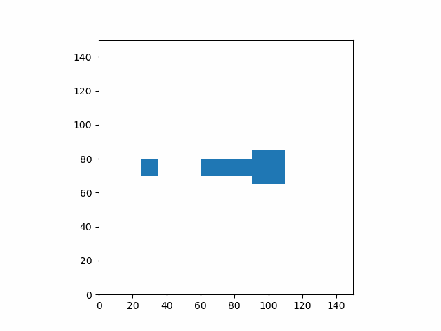

# Taller 1
Transformaciones básicas en computación visual.

## Processing
Transformaciones, rotaciones y escalado a varias figuras de cubo.

Se uso push y pop matrix para mantener las tranformaciones que se querian sobre ciertos objetos y separarlas de los otros.

Tranformacion global:
```java
  rotateX(-PI/8);
```
Tranformaciones en objetos discretos:
```java
  pushMatrix();
    // Translate to lower left corner of the screen
    translate(width/4, 7*height/8, 0);
    
    // Position reference frame
    rotateY(-PI/4);
    
    // Rotate animation
    rotateZ(PI*sin((float)millis()/1000.0));
    
    //set box color to red
    fill(255,0,0);
    
    // draw red boxes
    for(int i = 0; i < 10; i++){
      // draw boxes
      box(100);

      //translate back
      translate(0,0,-150);
    }
  popMatrix();
```
El sketch se puede correr con el archivo de [Processing](./processing/processing.pde)

## Python
Transformaciones, rotaciones y escalado a varias figuras de cuadrado.

Se crearon funciones de ayuda para crear distintas matrices de tranformación, aplicar una matriz a vertices y crear vertices de cuadrados

```python
# create a translation matrix
# x and y are the translation in the x and y direction
def tranMatrix(x,y):
    return np.array([[1,0,x],
                     [0,1,y],
                     [0,0,1]])

# create a rotation matrix
# angle is the rotation in radians
def rotMatrix(angle):
    return np.array([[np.cos(angle), -np.sin(angle), 0],
                     [np.sin(angle),  np.cos(angle), 0],
                     [            0,              0, 1]])

# create a scaling matrix
# x and y are the scaling in the x and y direction
def scaleMatrix(x,y):
    return np.array([[x,0,0],
                     [0,y,0],
                     [0,0,1]])

# apply a matrix to a polygon
# mat is the matrix to apply, pol is the polygon to apply it to
def applyMatrix(mat,pol):
    verts = []
    for i in range(pol.shape[0]):
        verts.append(mat@pol[i])
    return np.array(verts)

# create a box shape
# s is the size of the box
def box(s):
    return np.array([[-s/2,-s/2, 1],
                     [-s/2, s/2, 1],
                     [ s/2, s/2, 1],
                     [ s/2,-s/2, 1]])
```

Se crearon matrices para varias tranformaciones y se aplicaron a cada figura.

ejemplo:
```python
# frame time
ft = i/frames

# create a box shape
verts = box(20)

# translation to center
center = tranMatrix(width/2,height/2)
# rotation anticlockwise at 1hz
fullRot = rotMatrix(2*np.pi*ft)

transform = tranMatrix(25, 0)

# tranform to rotate around the center of the screen with a radius of 25
transform2 = center@fullRot
transform = transform2@transform

# apply the transform to the box shape
verts = applyMatrix(transform, verts)
```

Se añadieron las figuras creadas a imagenes y se unieron para formar el siguiente gif



el codigo que genera este gif esta en [jupyter notebook](./python/Untitled.ipynb)

## Three.js
Transformaciones, rotaciones y escalado a varias figuras de cubo.

Se agrego el ambiente un par de luces, los controles y un componente que contiene la comfiguracion de tres mesh con geometria de cajas.

```jsx
function App() {
  return (
    <div id="canvas-container" style={{ width: "100vw", height: "100vh" }}>
      <Canvas>
        <ambientLight intensity={0.4}/>
        <directionalLight position={[0, 0.5, 1]} intensity={1}/>
        <directionalLight position={[0, 1, 0]} intensity={1}/>
        <Boxes/>
        {/* orbit control setup */}
        <OrbitControls makeDefault/>
      </Canvas>
    </div>
  )
}
```

Despues similar que con python se crean matrices para transformar cada figura y se les aplica a su geomteria, con la diferencia de que three.js provee sus propias funciones de creacion de matrices

```jsx
// time constant adjusted so sin(time) frecuency is 1/4 
const time = clock.getElapsedTime() * Math.PI / 2;

// set the matrixAutoUpdate to false to avoid the matrix getting
// overwritten by the default behavior of three.js
boxRef.current.matrixAutoUpdate = false;
boxRef2.current.matrixAutoUpdate = false;
boxRef3.current.matrixAutoUpdate = false;

// world translation to facilitate the intuiton on the next transformations
const world = new Matrix4().makeTranslation(0,0,-1)
  .multiply(new Matrix4().makeRotationX(-Math.PI/4))
  .multiply(new Matrix4().makeRotationZ(-Math.PI/4));

// transform to translate in a circular path and rotate around the Y axis
let transform = new Matrix4().makeTranslation(3*Math.cos(time),3*Math.sin(time),0)
  .multiply(new Matrix4().makeRotationY(3*time+Math.PI))

// apply transform and world transform to the red box
boxRef.current.matrix.multiplyMatrices(world, transform);

// transform to orbit around the red box, and scale to half
transform
  .multiply(new Matrix4().makeTranslation(1.5,0,0))
  .multiply(new Matrix4().makeScale(0.5,0.5,0.5))

// apply transform and world transform to the blue box
boxRef2.current.matrix.multiplyMatrices(world, transform);

// transform to scale 6 times x and y interchangly so it always avoids the red and blue boxes
transform = new Matrix4().makeScale(
  Math.max(6*Math.sin(2*time-Math.PI*0.1) + 1, 1),
  Math.max(6*-Math.sin(2*time-Math.PI*0.1) + 1, 1),
  1);

// apply transform and world transform to the green box
boxRef3.current.matrix.multiplyMatrices(world, transform);
```

el codigo de la animacion se encuentra en [App.js](./threejs/src/App.jsx) y se puede correr con los comandos
```sh
cd threejs
npm install
npm run dev
```
