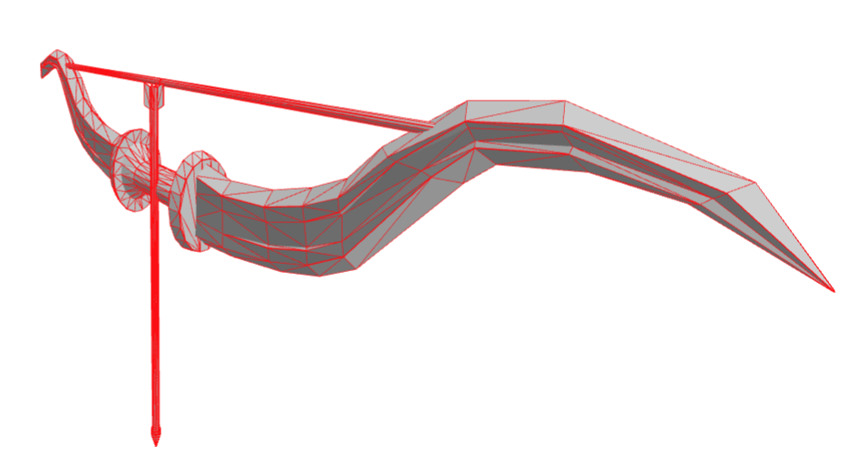
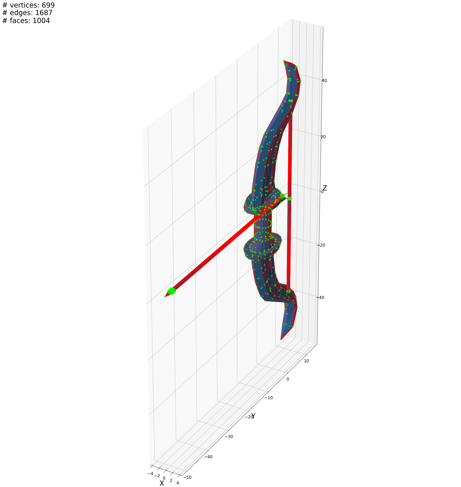

# Taller Estructuras 3D
estructuras 3D basicas de un objeto 3D

## Three.js
Se cargo un modelo de obj y se mostraron sus caras (en escala de grises) y sus bordes (en rojo)



el modelo se carga con la utilidad useLoader, a partir de las meshes obtenidas se calcula un mesh con geomwtria de wireframe y material de linea basico, despues se agregan ambas Meshes a la escena
```jsx
function ObjMesh(props) {
  const obj = useLoader(OBJLoader, props.url);
  const wireframe = (() => {
    const meshes = obj.children.filter(child => child.isMesh);
    const wireframes = meshes.map(mesh => {
      const wireframe = new THREE.LineSegments(
        new THREE.WireframeGeometry(mesh.geometry),
        new THREE.LineBasicMaterial({ color: 0xFF0000 })
      );
      return wireframe;
    });

    const group = new THREE.Group();
    wireframes.forEach(wireframe => group.add(wireframe));

    return group;
  })();

  return (
    <>
      <primitive object={obj}/>
      <primitive object={wireframe} />
    </>
  );
};
```
en la escena
```jsx
<Canvas>
  ...
  <ObjMesh url="bow.obj"/>
  ...
</Canvas>
```
el codigo se encuentra en [App.jsx](./threejs/src/App.jsx) y se puede correr con los comandos
```sh
cd threejs
npm install
npm run dev
```

# Python
Se cargo un modelo de obj y se mostraron sus caras (en escala de azules), sus bordes (en rojo) y sus vertices (en verde), asi como la catidad de cada uno



se carga el modelo usando trimesh, se dibujan sus caras y bordes con plot_trisurf, y sus vertices con scatter
```python
# Load the 3D model
mesh = trimesh.load_mesh('bow.obj')

# Extract vertices and faces
vertices = mesh.vertices
faces = mesh.faces
edges = mesh.edges

# Plot the 3D model using matplotlib
fig = plt.figure()
fig.set_size_inches(30,30)
ax = fig.add_subplot(projection='3d', box_aspect=(8, 60, 80))

# Plot the mesh
ax.plot_trisurf(vertices[:, 0], vertices[:, 1], vertices[:, 2], triangles=faces, edgecolor='r')
ax.scatter(vertices[:, 0], vertices[:, 1], vertices[:, 2], color='#00FF00')
```
luego se imprimen las cantidades, no antes descartando los bordes duplicados
```python
# Discard duplicated edges
# The edges are stored as pairs of vertex indices, so we need to sort them to find duplicates
nEdges = np.copy(edges)
n = nEdges.shape[0]
i = 0
while(i < n):
  edge = np.sort(nEdges[i])
  j = i + 1
  while(j < n):
    edge2 = np.sort(nEdges[j])
    if (edge[0] == edge2[0] and edge[1] == edge2[1]):
      nEdges = np.delete(nEdges, j, axis=0)
      n -= 1
    else:
      j += 1
  i += 1

#print number of vertices, edges and faces
ax.text2D(0, 1, f"# vertices: {vertices.shape[0]}\n# edges: {nEdges.shape[0]}\n# faces: {faces.shape[0]}", transform=ax.transAxes, fontsize=25)

```
el codigo que genera esta imagen se encuentra en [jupyter notebook](./pyhton/3d_world.ipynb)
