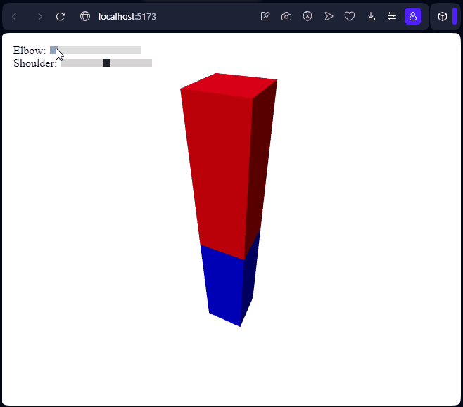

# Taller - Jerarquías y Transformaciones: El Árbol del Movimiento
Estructuras jerárquicas y árboles de transformación para organizar escenas y simular movimiento relativo entre objetos.

## Three.js
Se crea una escena con dos cajas que se interpretan como un brazo y antebrazo, agrupados en jerarquia de tal forma que roten como si fueran el hombro y codo.
```jsx
<>
  <group ref={shoulder}>
    <mesh position={[0, -1.5, 0]}>
      <boxGeometry args={[1, 3, 1]} />
      <meshStandardMaterial color="red" />
    </mesh>
    <group ref={elbow} position={[0, -3, 0]}>
      <mesh position={[0, -1.5, 0]}>
        <boxGeometry args={[1, 3, 1]} />
        <meshStandardMaterial color="blue" />
      </mesh>
    </group>
  </group>
</>
```
se encapsula en un componente que llamaos Arm, se agrega al canvas y se agregan controles
```jsx
const [shoulder, setShoulder] = useState({
  position: new THREE.Vector3(0,2.5,0),
  rotation: new THREE.Euler(0,0,0, "XYZ"),
  scale: new THREE.Vector3(1,1,1),
});
const [elbow, setElbow] = useState({
  position: new THREE.Vector3(0,0,0),
  rotation: new THREE.Euler(0,0,0, "XYZ"),
  scale: new THREE.Vector3(1,1,1),
});

return (
<Canvas>
  ...
  <Arm elbow={elbow} shoulder={shoulder}/>
  ...
</Canvas>
...
<label>
  Elbow: <wbr/>
  <input type="range" min={0} max={5*Math.PI/6} step={0.01} defaultValue={0} onChange={e => {
    const value = parseFloat(e.target.value);
    setElbow(prev => ({...prev, rotation: new THREE.Euler(prev.rotation.x, prev.rotation.y, value)}));
  }}/>
</label>

<label>
  Shoulder: <wbr/>
  <input type="range" min={-Math.PI/2} max={Math.PI/2} step={0.01} defaultValue={0} onChange={e => {
    const value = parseFloat(e.target.value);
    setShoulder(prev => ({...prev, rotation: new THREE.Euler(prev.rotation.x, prev.rotation.y, value)}));
  }}/>
</label>
);
```


el codigo se encuentra en [App.jsx](./threejs/src/App.jsx) y se puede correr con los comandos
```sh
cd threejs
npm install
npm run dev
```