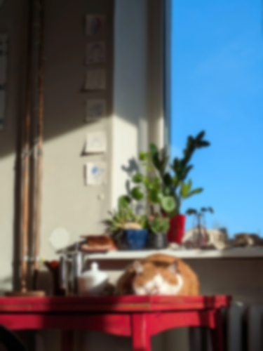

# Taller - Ojos Digitales: Introducción a la Visión Artificial
Fundamentos de la percepción visual artificial mediante imágenes en escala de grises, filtros y detección básica de bordes.

## Python

La siguiente imagen sera cargada con:
```python
og_image = cv2.imread('resting_cat.jpg')
```


Se reescala para que algunos de los efectos de filtros sean mas notorios
```python
# Calculate resized presentation dimensions
imgRatio = og_image.shape[0] / og_image.shape[1]
baseHeight = 500
winx = int(baseHeight/imgRatio)
winy = int(baseHeight)

# Resize image to presentation dimensions
image = cv2.resize(og_image, (winx, winy), 0, 0, cv2.INTER_AREA)
```

### Escala de grises
Se aplica el filtro
```python
image_gray = cv2.cvtColor(image, cv2.COLOR_BGR2GRAY)
```


### desenfoque gaussiano
Se aplica desenfoque gausiano con un kernel de tamaño 11 x 11
```python
blurred = cv2.GaussianBlur(image, (11, 11), 0)
```


### filtro de realce
Se aplica el filtro de realce con un kernel como el visto en clase
```python
kernel= np.array([[0, -1, 0],
                  [-1, 5, -1],
                  [0, -1, 0]])
sharpened = cv2.filter2D(image, -1, kernel)
```


## Deteccion de bordes
### Sobel
El filtro de Sobel obtiene una aproximacion de el gradiente de la imagen en una dirección.

Se aplica el filtro (sobre la imagen en escala de grises) en X y Y, se obtiene el absoluto y se limitan los valores obtenidos, luego se mezclan los valores de ambos filtros.
```python
sobel_x = cv2.Sobel(image_gray, cv2.CV_64F, 1, 0, ksize=3)
sobel_y = cv2.Sobel(image_gray, cv2.CV_64F, 0, 1, ksize=3)
sobel_x = cv2.convertScaleAbs(sobel_x)
sobel_y = cv2.convertScaleAbs(sobel_y)
sobel_total = cv2.addWeighted(sobel_x, 0.5, sobel_y, 0.5, 0)
```

### Laplaciano
El laplaciano obtiene la divergencia del gradiente de la imagen.

Se aplica el laplaciano, luego se obtiene el absoluto y se limitan los valores obtenidos.
```python
laplacian = cv2.Laplacian(image_gray, cv2.CV_64F)
laplacian = cv2.convertScaleAbs(laplacian)
```

### Comparacion
#### Sobel


#### Laplaciano


## Imagenes


el codigo que aplica estos filtros se encuentra en [jupyter notebook](python/ojos_digitales.ipynb)
