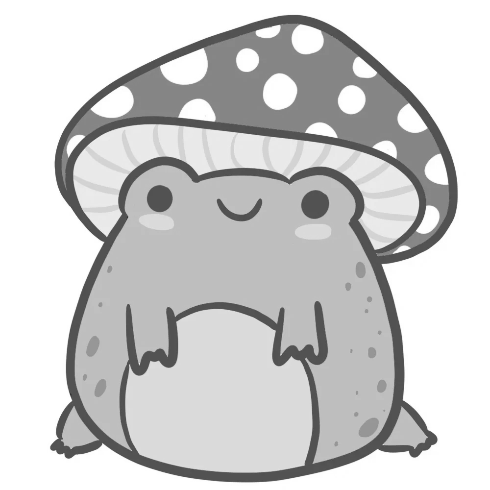
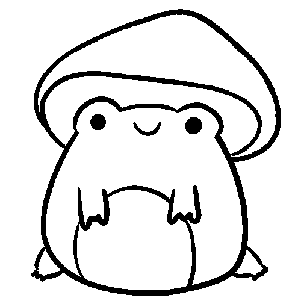

# Taller - Ojos Digitales: Introducción a la Visión Artificial
Fundamentos de la percepción visual artificial mediante imágenes en escala de grises, filtros y detección básica de bordes.

## Python

La siguiente imagen sera cargada con:
```python
og_image_gray = cv2.imread('../../assets/rana_hongo.png', cv2.IMREAD_GRAYSCALE)
```


Se reescala para que algunos de los efectos de filtros sean mas notorios
```python
image_gray = cv2.resize(og_image_gray, (0, 0), fx=0.5, fy=0.5, interpolation=cv2.INTER_AREA)
```
## Binarizacion
Se aplica el filtro
```python
_, binarized = cv2.threshold(image_gray, 127, 255, cv2.THRESH_BINARY)
```

### Binarizacion adaptativa
a Travez de un kernel de promedio y kernel gaussiano

```python
binarized_mean = cv2.adaptiveThreshold(image_gray, 255, cv2.ADAPTIVE_THRESH_MEAN_C, cv2.THRESH_BINARY, 13,2)
binarized_gaussian = cv2.adaptiveThreshold(image_gray, 255, cv2.ADAPTIVE_THRESH_GAUSSIAN_C, cv2.THRESH_BINARY, 13,2)
```

<br/>
binarizacion por kernel de promedio


<br/>
binarizacion por kernel gaussiano

## Contornos
Se detectan los contornos con ```cv2.findContours()``` y los superponemos a la imagen original

```python
contours, _ = cv2.findContours(binarized_mean, cv2.RETR_TREE, cv2.CHAIN_APPROX_SIMPLE)
contour_img = cv2.cvtColor(image_gray, cv2.COLOR_GRAY2BGR)

colors = [None]*len(contours)
for i in range(len(contours)):
  colors[i] = (rng.randint(191,255),rng.randint(0,255),rng.randint(0,63))
  colors[i] = sorted(colors[i], key=lambda x: rng.random())
  contour_img = cv2.drawContours(contour_img, contours, i, colors[i], 3)
```


es posible obtener los momentos de los contornos con `cv2.moments()` y con el resultado se puede obtner el centro de masa
de los contornos usando la siguiente formula `( m10/m00, m01/m00 )`, ahora se dibujan los centros de masa de los contornos.

```python
mc = [None]*len(contours)
for i in range(len(contours)):
  moment = cv2.moments(contours[i])
  mc[i] = (int(moment['m10']/(moment['m00'] + 1e-10)), int(moment['m01']/(moment['m00']+ 1e-10)))

center_mass = np.ones(contour_img.shape, dtype=np.uint8)
for i in range(len(contours)):
  center_mass = cv2.circle(center_mass, mc[i], 4, colors[i], -1)
center_mass = cv2.addWeighted(center_mass, 0.6, contour_img, 0.4, 0)
```


tambien es posible obtener la bounding box de los contornos con `cv2.boundingRect()`, y las dibujamos.
```python
bound_box = np.ones(contour_img.shape, dtype=np.uint8)
for i in range(len(contours)):
  x, y, w, h = cv2.boundingRect(contours[i])
  bound_box = cv2.rectangle(bound_box, (x,y), (x+w,y+h), colors[i], 2)
bound_box = cv2.addWeighted(bound_box, 0.6, contour_img, 0.4, 0)
```


recopliacion y algunas metricas


el codigo que aplica estos filtros y obtiene estos datos se encuentra en [jupyter notebook](python/segmentacion_formas.ipynb)
