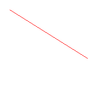
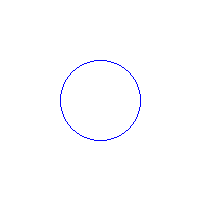
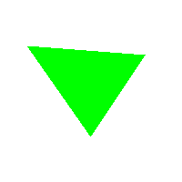

# Taller - Rasterización desde Cero: Dibujando con Algoritmos Clásicos

En este taller se implementan y exploran algoritmos básicos de rasterización para dibujar líneas, círculos y triángulos rellenos en una imagen.

## Configuración inicial

Se crea una imagen en blanco de tamaño 200x200 píxeles para realizar los dibujos.

```python
from PIL import Image, ImageDraw
import matplotlib.pyplot as plt

width, height = 200, 200
image = Image.new('RGB', (width, height), 'white')
pixels = image.load()
```

---

## Algoritmo de Bresenham para líneas

Se implementa el algoritmo de Bresenham para dibujar líneas entre dos puntos.

```python
def bresenham(x0, y0, x1, y1):
  dx = abs(x1 - x0)
  dy = abs(y1 - y0)
  sx = 1 if x0 < x1 else -1
  sy = 1 if y0 < y1 else -1
  err = dx - dy

  while True:
    pixels[x0, y0] = (255, 0, 0)
    if x0 == x1 and y0 == y1:
      break
    e2 = 2 * err
    if e2 > -dy:
      err -= dy
      x0 += sx
    if e2 < dx:
      err += dx
      y0 += sy
```

### Ejemplo

Se dibuja una línea desde `(20, 20)` hasta `(180, 120)`.

```python
bresenham(20, 20, 180, 120)
```
Resultado:



---

## Algoritmo de círculo por punto medio

Se implementa el algoritmo de punto medio para dibujar un círculo.

```python
def midpoint_circle(x0, y0, radius):
  x = radius
  y = 0
  p = 1 - radius

  while x >= y:
    for dx, dy in [(x, y), (y, x), (-x, y), (-y, x), (-x, -y), (-y, -x), (x, -y), (y, -x)]:
      if 0 <= x0 + dx < width and 0 <= y0 + dy < height:
        pixels[x0 + dx, y0 + dy] = (0, 0, 255)
    y += 1
    if p <= 0:
      p = p + 2*y + 1
    else:
      x -= 1
      p = p + 2*y - 2*x + 1
```

### Ejemplo

Se dibuja un círculo con centro en `(100, 100)` y radio `40`.

```python
midpoint_circle(100, 100, 40)
```

Resultado:



---

## Relleno de triángulos con rasterización por scanline

Se implementa un algoritmo de rasterización por scanline para rellenar triángulos.

```python
def fill_triangle(p1, p2, p3):
  pts = sorted([p1, p2, p3], key=lambda p: p[1])
  (x1, y1), (x2, y2), (x3, y3) = pts

  def interpolate(y0, y1, x0, x1):
    if y1 - y0 == 0: return []
    return [int(x0 + (x1 - x0) * (y - y0) / (y1 - y0)) for y in range(y0, y1)]

  x12 = interpolate(y1, y2, x1, x2)
  x23 = interpolate(y2, y3, x2, x3)
  x13 = interpolate(y1, y3, x1, x3)

  x_left = x12 + x23
  for y, xl, xr in zip(range(y1, y3), x13, x_left):
    for x in range(min(xl, xr), max(xl, xr)):
      if 0 <= x < width and 0 <= y < height:
        pixels[x, y] = (0, 255, 0)
```

### Ejemplo

Se dibuja un triángulo con vértices en `(30, 50)`, `(100, 150)` y `(160, 60)`.

```python
fill_triangle((30, 50), (100, 150), (160, 60))
```

Resultado:



---
el código completo se encuentra en [notebook](python/rasterizacion_algoritmos.ipynb).