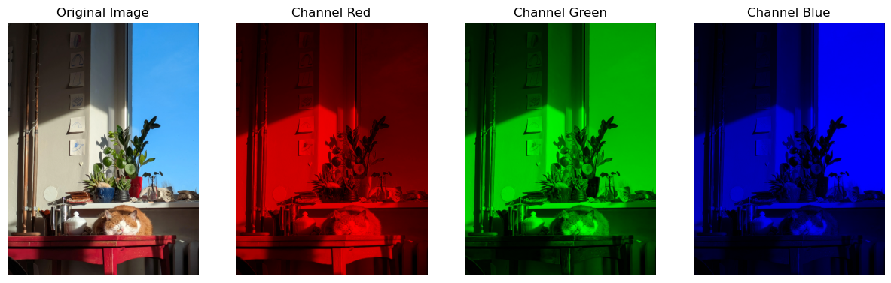
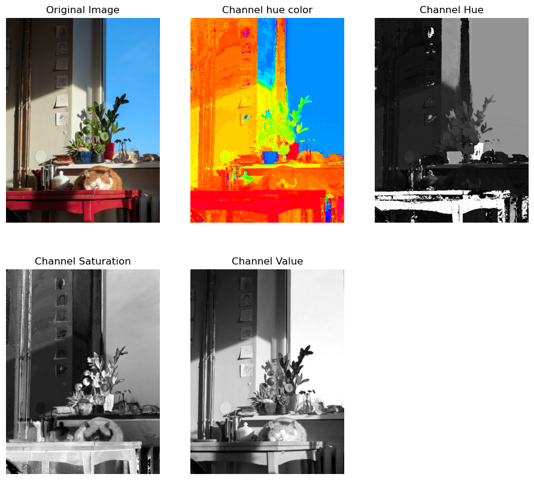
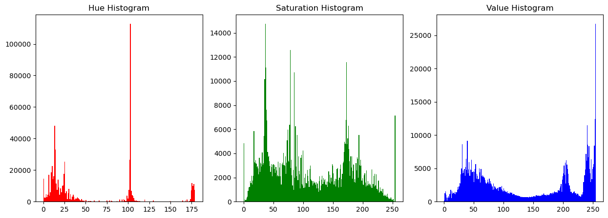
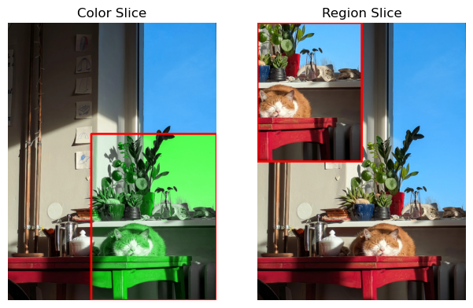
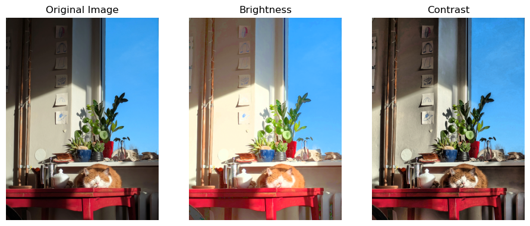

# Taller - De Pixels a Coordenadas: Explorando la Imagen como Matriz

En este taller se exploran diferentes técnicas para manipular y analizar imágenes como matrices de píxeles. Se utiliza una imagen de un gato descansando como ejemplo.

## Carga y reescalado de la imagen

La imagen se carga y se reescala para mejorar el rendimiento:

```python
og_image = cv2.imread('../../assets/resting_cat.jpg')
image = cv2.cvtColor(cv2.resize(og_image, (0,0), fx=0.2, fy=0.2), cv2.COLOR_BGR2RGB)
```


---

## Visualización de canales RGB

Se separan los canales de color (Rojo, Verde y Azul) de la imagen y se visualizan.

```python
ax = plt.subplot(141)
ax.set_title('Original Image')
ax.axis('off')
ax.imshow(image)

channels = ['Red', 'Green', 'Blue']

for i in range(3):
  image_channel = image.copy()

  image_channel[:, :, (i + 1) % 3] = 0
  image_channel[:, :, (i + 2) % 3] = 0

  ax = plt.subplot(1, 4, i + 2)
  ax.set_title(f'Channel {channels[i]}')
  ax.axis('off')
  ax.imshow(image_channel)
```


---

## Conversión a HSV y análisis de canales

La imagen se convierte al espacio de color HSV (Hue, Saturation, Value) y se visualizan los canales individuales.

```python
x = plt.subplot(231)
ax.set_title('Original Image')
ax.axis('off')
ax.imshow(image)

image_hsv = cv2.cvtColor(image, cv2.COLOR_RGB2HSV)
channels = ['Hue', 'Saturation', 'Value']

image_channel = image_hsv.copy()
image_channel[:, :, 1] = 255
image_channel[:, :, 2] = 255
image_channel = cv2.cvtColor(image_channel, cv2.COLOR_HSV2RGB)

ax = plt.subplot(232)
ax.set_title(f'Channel hue color')
ax.axis('off')
ax.imshow(image_channel)

for i in range(3):
  image_channel = image_hsv[:, :, i]

  # Display the modified image
  ax = plt.subplot(2, 3, i + 3)
  ax.set_title(f'Channel {channels[i]}')
  ax.axis('off')
  ax.imshow(image_channel, cmap='gray')
```


Se visualizan los histogramas de los canales HSV:

```python
ax.hist(image_hsv[:, :, 0].ravel(), bins=180, color='r')  # Hue
ax.hist(image_hsv[:, :, 1].ravel(), bins=256, color='g')  # Saturation
ax.hist(image_hsv[:, :, 2].ravel(), bins=256, color='b')  # Value
```


---

## Manipulación de regiones y colores

Se seleccionan regiones específicas de la imagen y se manipulan sus colores.
```python
color_slice_hsv = image_hsv.copy()

x_slice = ( 4*color_slice_hsv.shape[1]//10, 10*color_slice_hsv.shape[1]//10 )
y_slice = ( 4*color_slice_hsv.shape[0]//10, 10*color_slice_hsv.shape[0]//10 )

color_slice_hsv[y_slice[0]:y_slice[1], x_slice[0]:x_slice[1], 0] = 60
```

Se copia una región de la imagen y se reemplaza en otra ubicación.
```python
im_region_slice = image.copy()

region_width = 5

x_slice = ( 0, region_width*color_slice_hsv.shape[1]//10 )
y_slice = ( 0, region_width*color_slice_hsv.shape[0]//10 )

x_slice_2 = np.add(x_slice, (color_slice_hsv.shape[1]//2, color_slice_hsv.shape[1]//2))
y_slice_2 = np.add(y_slice, (color_slice_hsv.shape[0]//2, color_slice_hsv.shape[0]//2))

region = im_region_slice[y_slice_2[0]:y_slice_2[1], x_slice_2[0]:x_slice_2[1], :]

im_region_slice[y_slice[0]:y_slice[1], x_slice[0]:x_slice[1], :] = region
```


---

## Ajuste de brillo y contraste

Se ajusta el brillo y el contraste de la imagen utilizando el canal de valor (Value) en el espacio HSV.

### Brillo

```python
brightness_hsv = image_hsv.copy()
brightness_hsv[:, :, 2] = cv2.convertScaleAbs(image_hsv[:, :, 2], alpha=1, beta=75)
```

### Contraste

Se utiliza CLAHE (Contrast Limited Adaptive Histogram Equalization) para mejorar el contraste.

```python
contrast_hsv = image_hsv.copy()
clahe = cv2.createCLAHE(clipLimit=3.0, tileGridSize=(8, 8))
clahe_v = clahe.apply(v_channel)
contrast_hsv[:, :, 2] = clahe_v
```


---

Para más detalles, consulta el código completo en el [notebook](python/imagen_matriz_pixeles.ipynb).