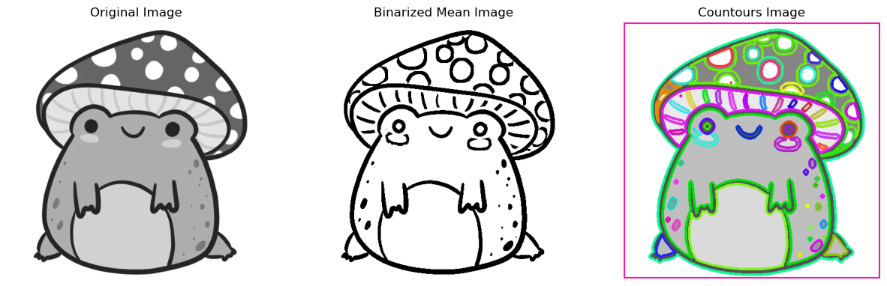

# Taller - Análisis de Figuras Geométricas

En este taller se implementan técnicas para analizar figuras geométricas en imágenes, como detección de contornos y cálculo de propiedades geométricas como área, perímetro y centro de masa.

## Carga y preprocesamiento de la imagen

Se carga una imagen en escala de grises y se redimensiona para facilitar el análisis.

```python
og_image_gray = cv2.imread('../../assets/rana_hongo.png', cv2.IMREAD_GRAYSCALE)
image_gray = cv2.resize(og_image_gray, (0, 0), fx=0.5, fy=0.5, interpolation=cv2.INTER_AREA)
```

Se aplica binarización adaptativa para resaltar las figuras geométricas.

```python
binarized_mean = cv2.adaptiveThreshold(image_gray, 255, cv2.ADAPTIVE_THRESH_MEAN_C, cv2.THRESH_BINARY, 13, 2)
```

---

## Detección de contornos

Se detectan los contornos de las figuras en la imagen binarizada utilizando `cv2.findContours`.

```python
contours, _ = cv2.findContours(binarized_mean, cv2.RETR_TREE, cv2.CHAIN_APPROX_SIMPLE)
```

Se dibujan los contornos detectados en la imagen con colores randomixados.

```python
for i in range(len(contours)):
  colors[i] = (rng.randint(191,255),rng.randint(0,255),rng.randint(0,63))
  colors[i] = sorted(colors[i], key=lambda x: rng.random())
  contour_img = cv2.drawContours(contour_img, contours, i, (0, 255, 0), 2)
```

### Ejemplo

Resultado de la imagen original, binarizada y con contornos detectados:

```python
ax = plt.subplot(131)
ax.set_title('Original Image')
ax.axis('off')
ax.imshow(image_gray, cmap='gray')

ax = plt.subplot(132)
ax.set_title('Binarized Mean Image')
ax.axis('off')
ax.imshow(binarized_mean, cmap='gray')

ax = plt.subplot(133)
ax.set_title('Countours Image')
ax.axis('off')
ax.imshow(contour_img)
```



---

## Cálculo de propiedades geométricas

Se calculan propiedades geométricas como el centro de masa

```python
mc = [None] * len(contours)
for i in range(len(contours)):
  moment = cv2.moments(contours[i])
  mc[i] = (int(moment['m10'] / (moment['m00'] + 1e-10)), int(moment['m01'] / (moment['m00'] + 1e-10)))
```
El área y el perímetro de cada contorno se calculan igualmente y se anotan las propiedades geométricas en la imagen.

```python
for i in range(len(contours)):
  colors[i] = (rng.randint(191,255),rng.randint(0,255),rng.randint(0,63))
  colors[i] = sorted(colors[i], key=lambda x: rng.random())
  contour_img_clean = cv2.drawContours(contour_img_clean, contours, i, (0, 255, 0), 2)

for i in range(len(contours)):
  text_height = cv2.getTextSize('0', cv2.FONT_HERSHEY_SIMPLEX, 1, 1)[0][1] + 1
  draw_point = mc[i]
  contour_img_clean = cv2.putText(
    contour_img_clean,
    f'x:{mc[i][0]} y:{mc[i][1]}',
    draw_point,
    cv2.FONT_HERSHEY_SIMPLEX, 1,
    (0,0,0), 1
  )

  draw_point = np.add(draw_point, (0, text_height))
  contour_img_clean = cv2.putText(
    contour_img_clean,
    f'area:{round(cv2.contourArea(contours[i]), 2)}',
    draw_point,
    cv2.FONT_HERSHEY_SIMPLEX, 1,
    (0,0,0), 1
  )

  draw_point = np.add(draw_point, (0, text_height))
  contour_img_clean = cv2.putText(
    contour_img_clean,
    f'perimetro:{round(cv2.arcLength(contours[i], True), 2)}',
    draw_point,
    cv2.FONT_HERSHEY_SIMPLEX, 1,
    (0,0,0), 1
  )
```

### Ejemplo

Resultado con las propiedades geométricas anotadas:
```python
plt.axis('off')
plt.imshow(contour_img_clean)
```


---

Para más detalles, consulta el código completo en [notebook](python/analisis_figuras_geometricas.ipynb).